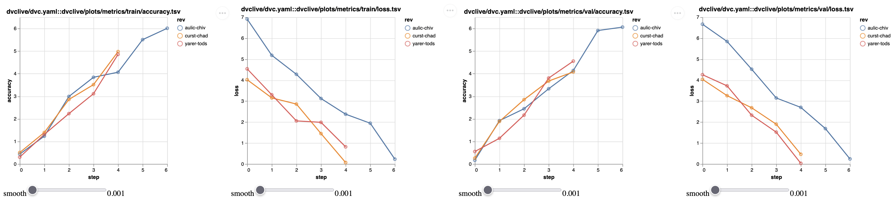
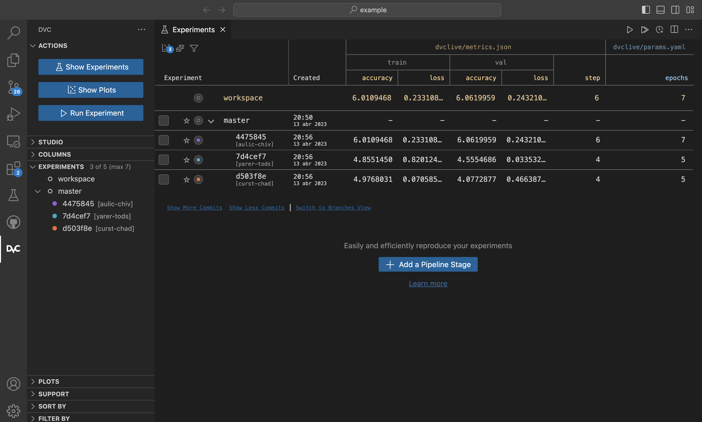
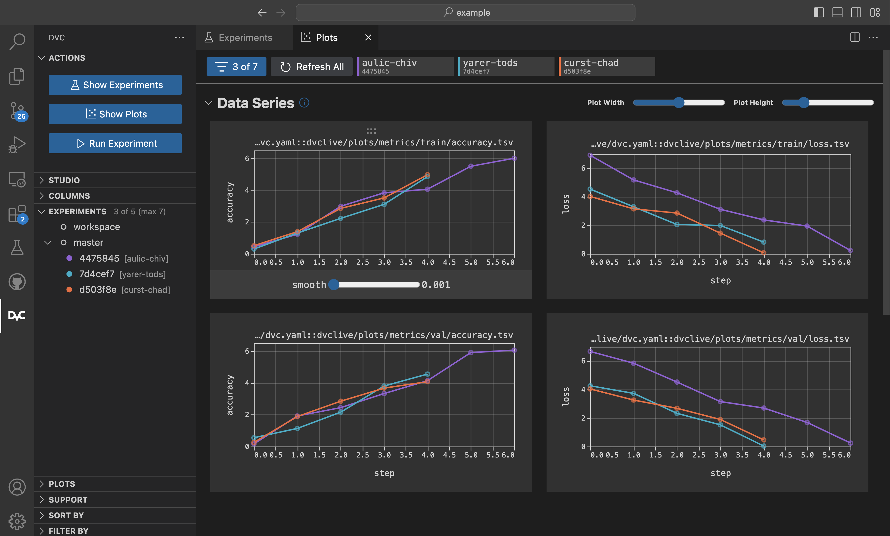
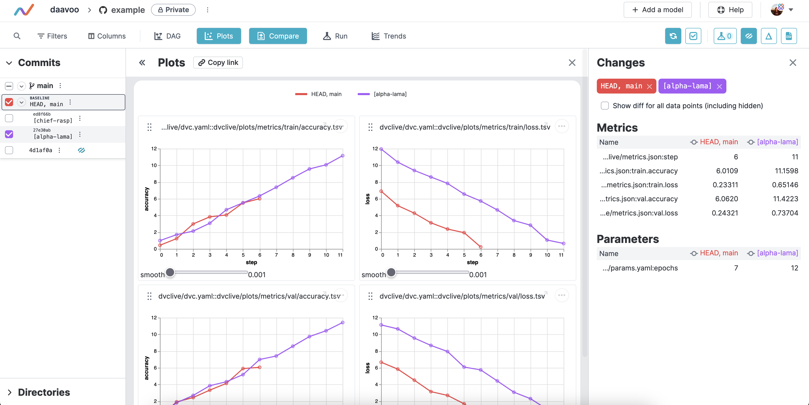

# DVCLive

[](https://pypi.org/project/dvclive/)
[](https://pypi.org/project/dvclive/)
[](https://pypi.org/project/dvclive)
[](https://opensource.org/licenses/Apache-2.0)

[](https://github.com/iterative/dvclive/actions?workflow=Tests)
[](https://app.codecov.io/gh/iterative/dvclive)
[](https://github.com/pre-commit/pre-commit)
[](https://github.com/psf/black)

DVCLive is a Python library for logging machine learning metrics and other
metadata in simple file formats, which is fully compatible with DVC.

# [Documentation](https://dvc.org/doc/dvclive)

- [Get Started](https://dvc.org/doc/start/experiments)
- [How it Works](https://dvc.org/doc/dvclive/how-it-works)
- [API Reference](https://dvc.org/doc/dvclive/live)
- [Integrations](https://dvc.org/doc/dvclive/ml-frameworks)

______________________________________________________________________

# Quickstart

| Python API Overview | PyTorch Lightning | Scikit-learn | Ultralytics YOLO v8 |
|--------|--------|--------|--------|
| <a href="https://colab.research.google.com/github/iterative/dvclive/blob/main/examples/DVCLive-Quickstart.ipynb"></a> | <a href="https://colab.research.google.com/github/iterative/dvclive/blob/main/examples/DVCLive-PyTorch-Lightning.ipynb"></a> | <a href="https://colab.research.google.com/github/iterative/dvclive/blob/main/examples/DVCLIve-scikit-learn.ipynb"></a> | <a href="https://colab.research.google.com/github/iterative/dvclive/blob/main/examples/DVCLive-YOLO.ipynb"></a> |

## Install *dvclive*

```console
$ pip install dvclive
```

## Initialize DVC Repository

```console
$ git init
$ dvc init
$ git commit -m "DVC init"
```

## Example code

Copy the snippet below into `train.py` for a basic API usage example:

```python
import time
import random

from dvclive import Live

params = {"learning_rate": 0.002, "optimizer": "Adam", "epochs": 20}

with Live() as live:

    # log a parameters
    for param in params:
        live.log_param(param, params[param])

    # simulate training
    offset = random.uniform(0.0.2, 0.1)
    for epoch in range(1, params["epochs"]):
        fuzz = random.uniform(0.01, 0.1)
        accuracy = 1 - (2 ** - epoch) - fuzz - offset
        loss = (2 ** - epoch) + fuzz + offset

        # log metrics to studio
        live.log_metric("accuracy", accuracy)
        live.log_metric("loss", loss)
        live.next_step()
        time.sleep(0.2)
```

See [Integrations](https://dvc.org/doc/dvclive/ml-frameworks) for examples using
DVCLive alongside different ML Frameworks.

## Running

Run this a couple of times to simulate multiple experiments:

```console
$ python train.py
$ python train.py
$ python train.py
...
```

## Comparing

DVCLive outputs can be rendered in different ways:

### DVC CLI

You can use [dvc exp show](https://dvc.org/doc/command-reference/exp/show) and
[dvc plots](https://dvc.org/doc/command-reference/plots) to compare and
visualize metrics, parameters and plots across experiments:

```console
$ dvc exp show
```

```
─────────────────────────────────────────────────────────────────────────────────────────────────────────────
Experiment                 Created    train.accuracy   train.loss   val.accuracy   val.loss   step   epochs
─────────────────────────────────────────────────────────────────────────────────────────────────────────────
workspace                  -                  6.0109      0.23311          6.062    0.24321      6   7
master                     08:50 PM                -            -              -          -      -   -
├── 4475845 [aulic-chiv]   08:56 PM           6.0109      0.23311          6.062    0.24321      6   7
├── 7d4cef7 [yarer-tods]   08:56 PM           4.8551      0.82012         4.5555   0.033533      4   5
└── d503f8e [curst-chad]   08:56 PM           4.9768     0.070585         4.0773    0.46639      4   5
─────────────────────────────────────────────────────────────────────────────────────────────────────────────
```

```console
$ dvc plots diff $(dvc exp list --names-only) --open
```



### DVC Extension for VS Code

Inside the
[DVC Extension for VS Code](https://marketplace.visualstudio.com/items?itemName=Iterative.dvc),
you can compare and visualize results using the
[Experiments](https://github.com/iterative/vscode-dvc/blob/main/extension/resources/walkthrough/experiments-table.md)
and
[Plots](https://github.com/iterative/vscode-dvc/blob/main/extension/resources/walkthrough/plots.md)
views:





While experiments are running, live updates will be displayed in both views.

### DVC Studio

If you push the results to [DVC Studio](https://dvc.org/doc/studio), you can
compare experiments against the entire repo history:



You can enable
[Studio Live Experiments](https://dvc.org/doc/studio/user-guide/projects-and-experiments/live-metrics-and-plots)
to see live updates while experiments are running.

______________________________________________________________________

# Comparison to related technologies

**DVCLive** is an *ML Logger*, similar to:

- [MLFlow](https://mlflow.org/)
- [Weights & Biases](https://wandb.ai/site)
- [Neptune](https://neptune.ai/)

The main differences with those *ML Loggers* are:

- **DVCLive** does not **require** any additional services or servers to run.
- **DVCLive** metrics, parameters, and plots are
  [stored as plain text files](https://dvc.org/doc/dvclive/how-it-works#directory-structure)
  that can be versioned by tools like Git or tracked as pointers to files in DVC
  storage.
- **DVCLive** can save experiments or runs as
  [hidden Git commits](https://dvc.org/doc/dvclive/how-it-works#track-the-results).

You can then use different [options](#comparing) to visualize the metrics,
parameters, and plots across experiments.

______________________________________________________________________

# Contributing

Contributions are very welcome. To learn more, see the
[Contributor Guide](CONTRIBUTING.rst).

# License

Distributed under the terms of the
[Apache 2.0 license](https://opensource.org/licenses/Apache-2.0), *dvclive* is
free and open source software.
